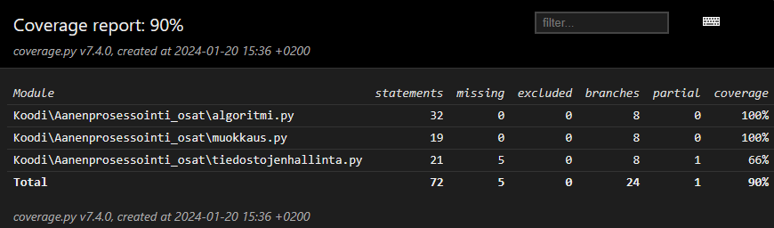

# Testausdokumentti

## Yksikkötestauksen kattavuusraportti

## Mitä on testattu ja miten
### algoritmi/ FFT ja IFFT
Testaus on suoritettu vertaamalla Scipy.IO toteutukseen. Jos funktioiden arvojen erotus jokaisessa kohdassa on alle 0.00001, on testi hyväksytty.

### muokkaus/ voimakkain_signaali
Toteutettu Randomisoidulla testauksella. 100 kertaa 100 satunnaista lukua väliltä 0-100.

### muokkaus/ poista_signaali
Toteutettu Randomisoidulla testauksella. 100 kertaa 100 satunnaista lukua väliltä 0-100.

## Miten testit voidaan toistaa
Komento `poetry run test` suorittaa testit.

Komento `poetry run generateReport` luo coverage raportin ja htmlcov hakemiston.
